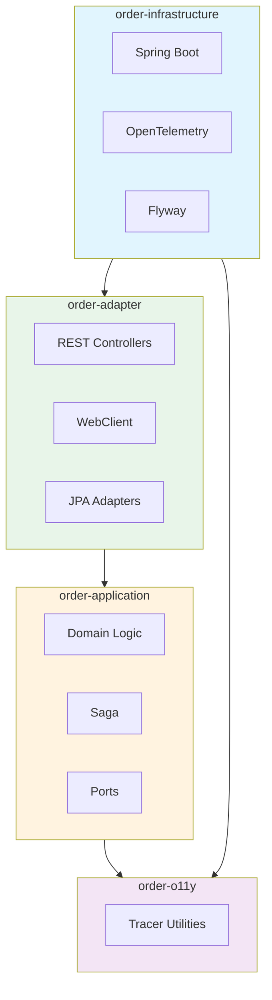
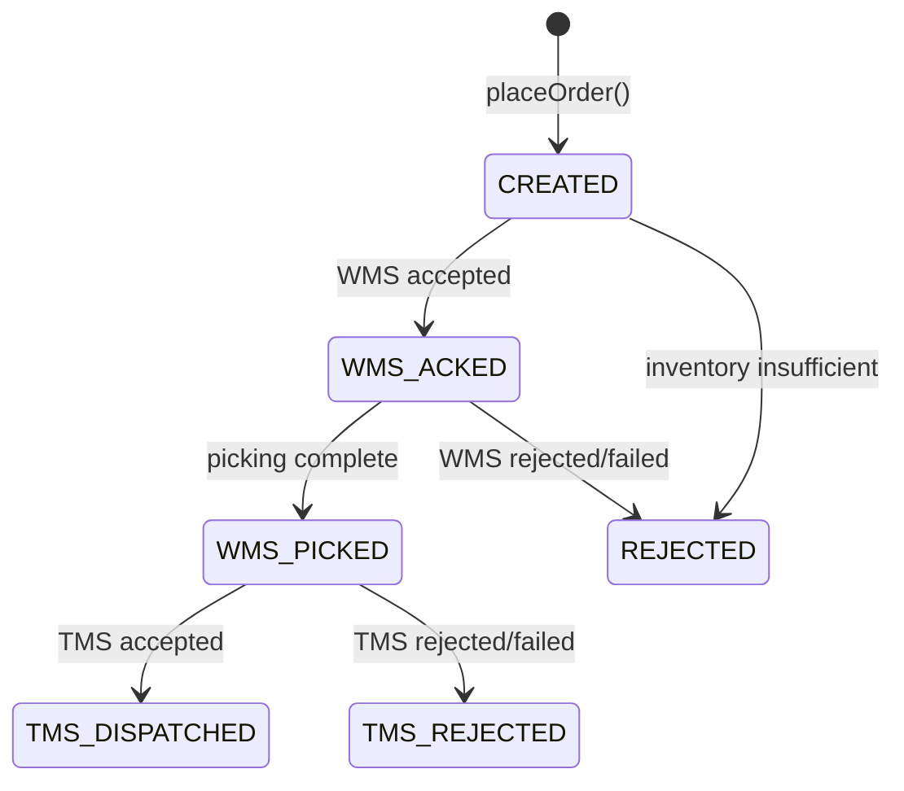
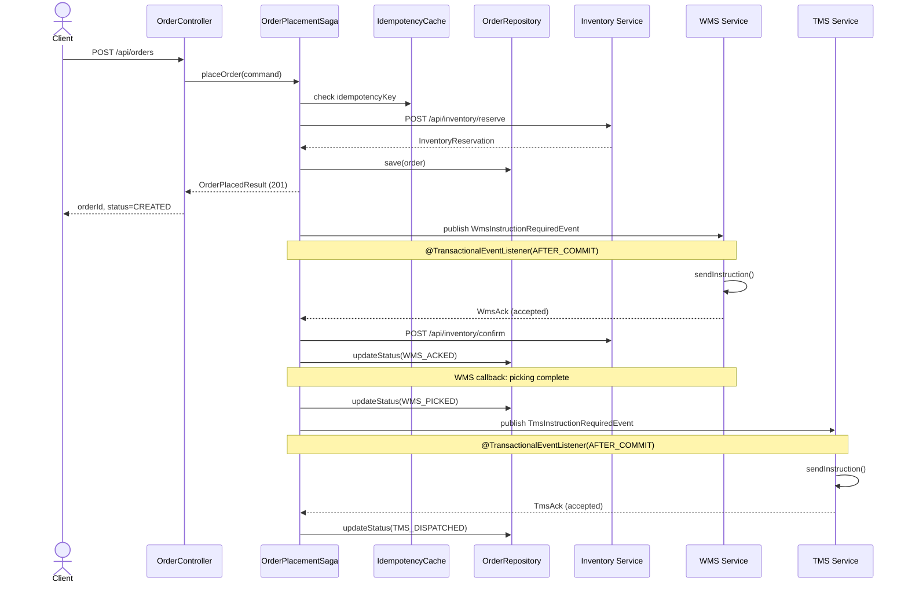
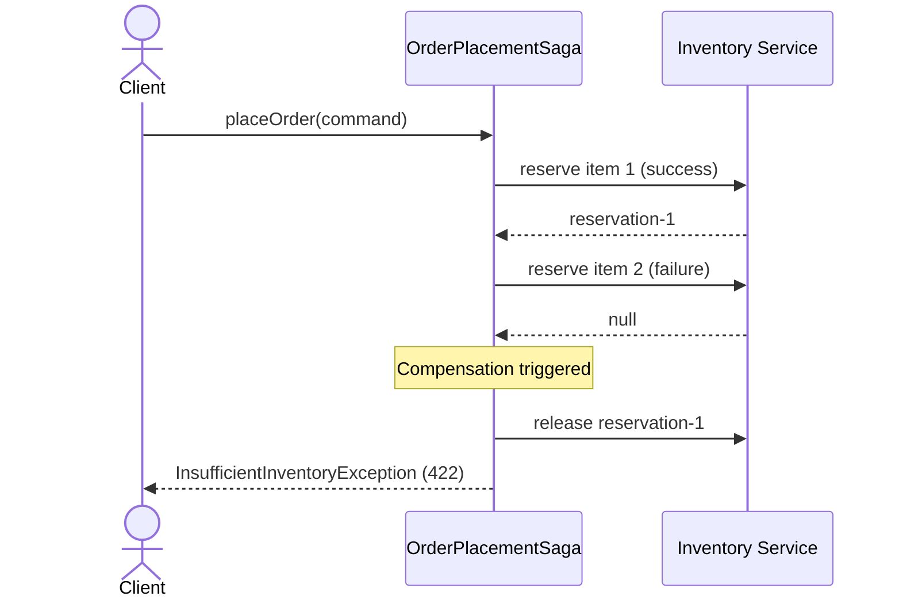
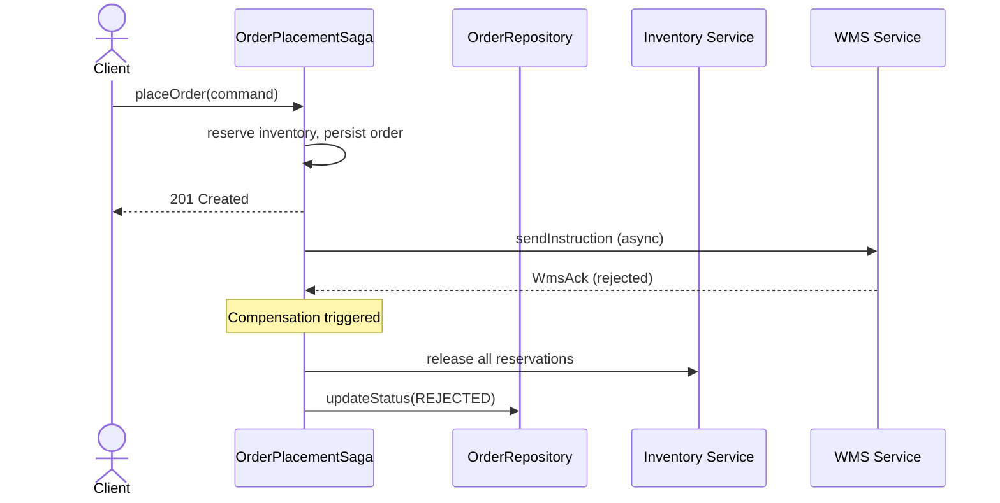
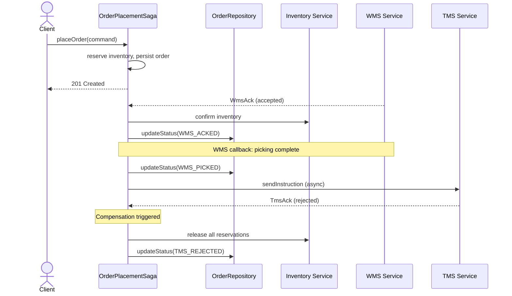

# Order Service

A production-ready Spring Boot order service demonstrating **hexagonal architecture** (ports and adapters), **Saga pattern** for distributed transactions, **circuit breakers**, **idempotency**, **distributed tracing** with OpenTelemetry, **OAuth2/JWT security**, **Prometheus metrics**, and **Kubernetes deployment**.

[](https://openjdk.org/projects/jdk/21/)
[](https://spring.io/projects/spring-boot)
[](https://maven.apache.org/)
[](https://github.com/example/order-demo/actions)
[](https://codecov.io/gh/example/order-demo)
[](LICENSE)

---

## Table of Contents

- [Architecture Overview](#architecture-overview)
- [Key Innovations](#key-innovations)
- [Domain Model](#domain-model)
- [API Documentation](#api-documentation)
- [Saga Flow](#saga-flow)
- [Testing Strategy](#testing-strategy)
- [Technology Stack](#technology-stack)
- [Quick Start](#quick-start)
- [Configuration](#configuration)
- [Observability](#observability)
- [Security](#security)
- [Deployment](#deployment)
- [Architecture Decision Records](#architecture-decision-records)
- [Contributing](#contributing)

---

## Architecture Overview

This project follows **Hexagonal Architecture** (Ports and Adapters) with a strict dependency flow that keeps domain logic free of framework dependencies.

### Module Structure



| Module | Purpose | Framework Dependencies |
|--------|---------|----------------------|
| `order-application` | Core domain logic and use cases | None (pure Java) |
| `order-adapter` | REST controllers, outbound adapters (HTTP, JPA) | Spring Boot Web, WebFlux, JPA, Kafka |
| `order-infrastructure` | Spring Boot entry point, OTel config, persistence | Spring Boot, Micrometer, Flyway |
| `order-o11y` | OpenTelemetry utilities | `opentelemetry-api` |
| `bdd-specs` | Cucumber BDD tests with WireMock | Cucumber, WireMock, Testcontainers |

### Dependency Rules

- `order-application` has **no dependencies** on other modules — domain logic is framework-agnostic
- `order-adapter` depends on `order-application` and `order-o11y`
- `order-infrastructure` depends on `order-adapter` and `order-o11y`

These boundaries are **enforced at build time** by ArchUnit architecture tests.

---

## Key Innovations

### 1. Async Saga Orchestration with Compensation

The `OrderPlacementSaga` coordinates four distributed services (Inventory, Order DB, WMS, TMS) using the **Saga pattern** with compensating transactions:

- **Happy Path**: Reserve inventory → Persist order → Send WMS instruction → Confirm inventory → Order status: `WMS_ACKED` → WMS picking complete → Order status: `WMS_PICKED` → Send TMS instruction → Order status: `TMS_DISPATCHED`
- **Failure Path**: If inventory reservation fails, all previously reserved items are **released** (compensation) → Order status: `REJECTED`
- **Async WMS Callback**: Uses `@TransactionalEventListener(phase = TransactionPhase.AFTER_COMMIT)` + `CompletableFuture.thenCompose()` + `TransactionTemplate` to handle WMS responses asynchronously while maintaining database consistency
- **TMS Dispatch**: After WMS confirms picking is complete, the saga publishes a `TmsInstructionRequiredEvent` to trigger TMS dispatch

```java
@TransactionalEventListener(phase = TransactionPhase.AFTER_COMMIT)
public void onTmsRequired(TmsInstructionRequiredEvent event) {
    tmsPort.sendInstruction(event.getInstruction())
        .thenCompose(ack -> {
            if (ack.isAccepted()) {
                return CompletableFuture.runAsync(() -> transactionTemplate.executeWithoutResult(
                    status -> orderRepository.updateStatus(..., TMS_DISPATCHED)));
            } else {
                return releaseAllAsync(event.getReservations())
                    .thenRun(() -> transactionTemplate.executeWithoutResult(
                        status -> orderRepository.updateStatus(..., TMS_REJECTED)));
            }
        })
        .exceptionally(ex -> {
            // Release inventory and mark rejected on transport failure
            ...
        });
}
```

### 2. Dual-Layer Idempotency

Orders are deduplicated by `idempotencyKey` using a **two-tier approach**:

1. **Caffeine Cache** (fast path): In-memory lookup with 30-minute TTL, max 10,000 entries
2. **Database** (source of truth): `findByIdempotencyKey()` query for cache misses

This pattern provides sub-millisecond duplicate detection for hot keys while ensuring correctness across service restarts.

### 3. Reactive HTTP with Resilience4j

Outbound HTTP calls use **Spring WebClient** with reactive programming, protected by circuit breakers and retry:

```java
@CircuitBreaker(name = "inventoryService", fallbackMethod = "handleOccupyFallback")
@Retry(name = "inventoryService")
public CompletableFuture<InventoryReservation> occupy(ReservationRequest request) {
    return webClient.post()
        .uri("/api/inventory/reserve")
        .bodyValue(request)
        .retrieve()
        .bodyToMono(InventoryApiResponse.class)
        .flatMap(response -> /* handle success/failure */)
        .doOnError(ex -> span.recordException(ex))
        .toFuture();  // Converts Mono to CompletableFuture
}
```

| Resilience Config | Inventory Service | WMS Service | TMS Service |
|--------------------|-------------------|-------------|-------------|
| Failure Rate Threshold | 50% | 50% | 50% |
| Slow Call Rate Threshold | 80% | 80% | 80% |
| Retry Attempts | 3 | 3 | 3 |
| Retry Backoff | Exponential (500ms × 2ⁿ) | Exponential (500ms × 2ⁿ) | Exponential (500ms × 2ⁿ) |
| Circuit Open Duration | 30s | 30s | 30s |

### 4. Distributed Tracing with OpenTelemetry

Custom `@Traced` annotation creates OpenTelemetry spans for key operations:

```java
@PostMapping
@Traced(spanName = SpanNames.ORDER_PLACEMENT)
public ResponseEntity<OrderResponse> placeOrder(...) { ... }
```

Spans are exported via OTLP to **Jaeger** for visualization. Trace IDs propagate across HTTP calls using W3C `traceparent` and B3 headers.

### 5. Architecture Testing with ArchUnit

Build-time architecture tests enforce hexagonal boundaries:

```java
@ArchTest
static final ArchRule application_layer_should_not_depend_on_adapter_or_infrastructure =
    noClasses().that().resideInAPackage("..order.application..")
        .should().dependOnClassesThat()
        .resideInAnyPackage("..order.adapter..", "..order.infrastructure..");

@ArchTest
static final ArchRule no_cyclic_dependencies =
    slices().matching("com.example.order.(*)..")
        .should().beFreeOfCycles();
```

---

## Domain Model

### Order Status State Machine



| Status | Meaning | Trigger |
|--------|---------|---------|
| `CREATED` | Order persisted | `placeOrder()` |
| `WMS_ACKED` | WMS accepted shipment instruction, inventory confirmed | `onWmsRequired()` |
| `WMS_PICKED` | WMS confirmed picking complete | `onWmsPickingCompleted()` |
| `TMS_DISPATCHED` | TMS accepted dispatch instruction | `onTmsRequired()` |
| `TMS_REJECTED` | TMS rejected or failed | `onTmsRequired()` (compensation) |
| `REJECTED` | WMS rejected or failed | `onWmsRequired()` (compensation) |

### Core Entities

| Entity | Key Fields | Description |
|--------|-----------|-------------|
| **Order** | `orderId`, `customerId`, `items`, `status`, `idempotencyKey`, `reservationId` | Aggregate root with status transitions |
| **InventoryReservation** | `reservationId`, `sku`, `quantity`, `status` | Immutable value object with `PENDING` → `CONFIRMED` → `RELEASED` |
| **WmsShipmentInstruction** | `orderId`, `reservationId` | Event payload for WMS integration |
| **TmsShipmentInstruction** | `orderId`, `reservationId` | Event payload for TMS dispatch |

---

## API Documentation

### Base Path

```
/api/orders
```

### Endpoints

| Method | Endpoint | Description | Status Codes |
|--------|----------|-------------|--------------|
| `POST` | `/api/orders` | Place a new order | `201`, `400`, `409`, `422`, `500` |
| `GET` | `/api/orders/{id}` | Get order by ID | `200`, `404` |

### Place Order Request

```json
{
  "customerId": "customer-1",
  "idempotencyKey": "idem-key-123",
  "items": [
    { "sku": "sku-1", "quantity": 2 }
  ]
}
```

### Place Order Response (201 Created)

```json
{
  "orderId": "550e8400-e29b-41d4-a716-446655440000",
  "status": "CREATED",
  "traceId": "abc123def456"
}
```

Response includes `Location: /api/orders/{orderId}` header.

### Error Responses

| Status | Error | Scenario |
|--------|-------|----------|
| `400` | Validation error | Missing `customerId`, blank `idempotencyKey`, empty `items` |
| `409` | `DuplicateOrderException` | Same `idempotencyKey` already exists |
| `422` | `InsufficientInventoryException` | Inventory service returned insufficient stock |
| `500` | Service unavailable | Circuit breaker open or inventory service down |

---

## Saga Flow

### Happy Path



### Failure Path (Inventory Unavailable)



### Failure Path (WMS Rejects)



### Failure Path (TMS Rejects)



---

## Testing Strategy

The project employs a **comprehensive testing pyramid** with 80% line coverage enforced by JaCoCo:

```
         ┌─────────────┐
         │   BDD Tests   │  16 Cucumber scenarios
         │  (bdd-specs)  │  WireMock + Testcontainers
         ├───────────────┤
         │  Integration  │  JPA repository tests
         │     Tests      │  ArchUnit architecture rules
         ├───────────────┤
         │   Unit Tests   │  Domain model, Saga, Adapters
         │  (JUnit 5)     │  Mockito + AssertJ
         └───────────────┘
```

### BDD Scenario Coverage

| Feature File | Scenarios | Coverage |
|-------------|-----------|----------|
| `place_order.feature` | Happy path, insufficient inventory, duplicate order | Core business flows |
| `place_order_multi_item.feature` | Multi-item success, partial failure with compensation | Complex reservation logic |
| `place_order_wms_failure.feature` | WMS rejection, WMS unavailability | Async callback handling |
| `place_order_tms.feature` | TMS acceptance, TMS rejection, TMS unavailability | End-to-end dispatch flow |
| `place_order_circuit_breaker.feature` | Service unavailable returns 500 | Resilience patterns |
| `place_order_trace_id.feature` | X-B3-TraceId, traceparent propagation | Distributed tracing |
| `place_order_validation.feature` | Missing fields, blank values | Input validation |

### Architecture Tests

ArchUnit rules enforce:
- No dependencies from `order.application` to `order.adapter` or `order.infrastructure`
- REST controllers must reside in `adapter.inbound.rest`
- JPA entities must reside in `adapter.outbound.persistence`
- Domain events must be immutable (only `final` fields)
- All ports must be interfaces
- No cyclic dependencies between modules

---

## Technology Stack

| Technology | Version | Purpose |
|-----------|---------|---------|
| Java | 21 | Language |
| Spring Boot | 3.4.3 | Application framework |
| Spring Cloud | 2023.0.6 | Cloud-native patterns |
| Spring Security OAuth2 | 6.x | JWT resource server |
| SpringDoc OpenAPI | 2.5.0 | API documentation |
| Maven | 3.9+ | Build tool |
| PostgreSQL | 16 | Production database |
| H2 | 2.x | Development database |
| Flyway | 10.x | Database migrations |
| Resilience4j | 2.x | Circuit breakers, retry, rate limiting |
| OpenTelemetry | 1.37.0 | Distributed tracing |
| Jaeger | 1.52 | Trace visualization |
| Micrometer Prometheus | 1.12.x | Metrics exposition |
| Logstash Logback | 7.4 | JSON structured logging |
| Cucumber | 7.14.1 | BDD testing |
| WireMock | 3.x | HTTP service virtualization |
| Testcontainers | 1.19.0 | Integration test infrastructure |
| ArchUnit | 1.3.0 | Architecture testing |
| JaCoCo | 0.8.13 | Code coverage (80% threshold) |
| OWASP Dependency-Check | 9.x | Vulnerability scanning |

---

## Quick Start

### Prerequisites

- Java 21
- Maven 3.9+
- Docker & Docker Compose (for local infrastructure)

### Build

```bash
# Using Makefile (recommended)
make build

# Or using Maven directly
mvn clean install
```

### Run Tests

```bash
# Using Makefile
make test          # Unit tests
make test-integration  # Integration tests
make test-bdd      # BDD/Cucumber tests
make test-arch     # Architecture tests
make test-coverage # Tests with coverage report

# Or using Maven directly
mvn test                                    # Unit tests
mvn verify                                  # Integration tests
mvn -pl bdd-specs test -Dtest=CucumberTestSuite  # BDD tests
mvn -pl order-infrastructure test -Dtest=ArchitectureTest  # Architecture tests
```

### Run Locally

```bash
# One-command setup (recommended)
./scripts/setup-local.sh

# Or step by step with Makefile
make dev           # Start dependencies (Jaeger, PostgreSQL)
make run           # Start the application

# Or manually
docker-compose up -d
mvn -pl order-infrastructure spring-boot:run
```
mvn -pl order-infrastructure spring-boot:run
```

### Access Services

| Service | URL | Description |
|---------|-----|-------------|
| Order Service API | http://localhost:8080/api/orders | Place orders |
| Swagger UI | http://localhost:8080/swagger-ui.html | Interactive API documentation |
| OpenAPI Spec | http://localhost:8080/v3/api-docs | OpenAPI 3.0 JSON specification |
| Health Check | http://localhost:8080/actuator/health | Overall health status |
| Liveness Probe | http://localhost:8080/actuator/health/liveness | Kubernetes liveness |
| Readiness Probe | http://localhost:8080/actuator/health/readiness | Kubernetes readiness |
| Prometheus | http://localhost:8080/actuator/prometheus | Metrics in Prometheus format |
| Jaeger UI | http://localhost:16686 | Distributed tracing visualization |

---

## Configuration

### Key Properties

| Property | Default | Description |
|----------|---------|-------------|
| `inventory.base-url` | `http://localhost:8081` | Inventory service base URL |
| `wms.base-url` | `http://localhost:8082` | WMS service base URL |
| `tms.base-url` | `http://localhost:8083` | TMS service base URL |
| `otel.exporter.endpoint` | `http://localhost:4317` | OpenTelemetry OTLP endpoint |
| `spring.datasource.url` | H2 in-memory | Database connection (override for PostgreSQL) |

### Circuit Breaker Configuration

```yaml
resilience4j:
  circuitbreaker:
    instances:
      inventoryService:
        failureRateThreshold: 50
        slowCallRateThreshold: 80
        slidingWindowSize: 10
        waitDurationInOpenState: 30s
      wmsService:
        # Same configuration
      tmsService:
        # Same configuration
  retry:
    instances:
      inventoryService:
        maxAttempts: 3
        waitDuration: 500ms
        enableExponentialBackoff: true
        exponentialBackoffMultiplier: 2
      wmsService:
        # Same configuration
      tmsService:
        # Same configuration
```

### Docker Compose Services

```yaml
services:
  jaeger:
    image: jaegertracing/all-in-one:1.52
    ports:
      - "16686:16686"  # Jaeger UI
      - "4317:4317"    # OTLP gRPC

  postgres:
    image: postgres:16-alpine
    ports:
      - "5432:5432"
    environment:
      POSTGRES_DB: orderdb
      POSTGRES_USER: orderuser
      POSTGRES_PASSWORD: orderpass

  tms-mock:
    image: mockserver/mockserver:5.15.0
    ports:
      - "8083:1080"
    environment:
      MOCKSERVER_SERVER_PORT: 1080
```

---

## Observability

This application uses **[o11y-kit](o11y-kit/README.md)** — an open-source Spring HTTP observability SDK — as its observability layer. All HTTP traffic (inbound controllers, outbound WebClient and RestTemplate calls) is automatically instrumented via the `o11y-kit-spring-boot-starter` dependency, producing unified Micrometer metrics and optional OpenTelemetry spans.

**Metrics produced by o11y-kit** (exposed at `/actuator/prometheus`):
- `o11y.server.requests` — inbound Controller request duration (tags: `method`, `uri`, `status`)
- `o11y.client.requests` — outbound HTTP call duration (tags: `method`, `host`, `status`)
- `o11y.client.errors` — outbound HTTP call error count (tags: `method`, `host`, `error`)

**Tracing**: OpenTelemetry spans are exported via OTLP to **Jaeger** at `http://localhost:4317`. Trace IDs propagate across HTTP calls using W3C `traceparent` and `X-B3-TraceId` headers, and are returned in the `X-Trace-Id` response header.

**What about the old `order-o11y` module?** The legacy inline observability code has been replaced by the extracted [o11y-kit](o11y-kit/README.md) library. The `order-o11y` module is retained temporarily for backward compatibility during migration.

### Prometheus Metrics

The application exposes metrics in Prometheus format at `/actuator/prometheus`.

**Custom Business Metrics:**

| Metric | Type | Description |
|--------|------|-------------|
| `orders.placed` | Counter | Total orders placed, tagged by status |
| `orders.failed` | Counter | Failed order placements, tagged by reason |
| `inventory.reservation` | Counter | Inventory reservation attempts, tagged by SKU and result |
| `saga.duration` | Timer | Saga execution duration in milliseconds, tagged by outcome |

**Infrastructure Metrics:**

| Metric | Type | Description |
|--------|------|-------------|
| `http.server.requests` | Timer | HTTP request duration with percentiles histogram |
| `resilience4j.circuitbreaker.state` | Gauge | Circuit breaker state (CLOSED, OPEN, HALF_OPEN) |
| `jvm.memory.used` | Gauge | JVM memory usage |
| `jvm.threads.live` | Gauge | Number of live JVM threads |

### JSON Structured Logging

Logs are emitted in JSON format with the following fields:

```json
{
  "@timestamp": "2024-01-15T10:30:00.000Z",
  "level": "INFO",
  "logger": "com.example.order.application.service.OrderPlacementSaga",
  "message": "Order persisted with 1 reservation(s)",
  "trace_id": "abc123def456",
  "span_id": "789ghi",
  "service": "order-service",
  "version": "0.1.0-SNAPSHOT",
  "thread": "http-nio-8080-exec-1",
  "class": "com.example.order.application.service.OrderPlacementSaga",
  "method": "placeOrder"
}
```

This format is compatible with ELK, Loki, and other log aggregation systems.

### Health Probes

The application exposes Kubernetes-compatible health probes:

| Probe | Endpoint | Purpose |
|-------|----------|---------|
| Liveness | `/actuator/health/liveness` | Determines if the pod should be restarted |
| Readiness | `/actuator/health/readiness` | Determines if the pod should receive traffic |

**Custom Health Indicators:**

- `InventoryServiceHealthIndicator` — Checks connectivity to the inventory service
- `WmsServiceHealthIndicator` — Checks connectivity to the WMS service
- `TmsServiceHealthIndicator` — Checks connectivity to the TMS service

---

## Security

### OAuth2/JWT Authentication

The API is secured with OAuth2 resource server configuration. All endpoints except health, metrics, and Swagger require a valid JWT token.

**Public Endpoints (no authentication):**
- `GET /actuator/health` — Health check
- `GET /actuator/health/liveness` — Liveness probe
- `GET /actuator/health/readiness` — Readiness probe
- `GET /actuator/metrics` — Metrics
- `GET /actuator/prometheus` — Prometheus metrics
- `GET /swagger-ui.html` — Swagger UI
- `GET /v3/api-docs` — OpenAPI spec

**Protected Endpoints (JWT required):**
- `POST /api/orders` — Requires `SCOPE_order:write`

**JWT Configuration:**

```yaml
spring:
  security:
    oauth2:
      resourceserver:
        jwt:
          issuer-uri: https://auth.example.com
```

### Container Security

The Docker image follows security best practices:

- **Non-root user**: Runs as `appuser` (UID 1000)
- **Distroless base**: Uses `eclipse-temurin:21-jre-alpine` for minimal attack surface
- **Read-only root filesystem**: Container filesystem is read-only
- **No privilege escalation**: `allowPrivilegeEscalation: false`
- **Vulnerability scanning**: Trivy scans in CI pipeline

---

## Deployment

### Docker

```bash
# Build image
make docker-build

# Or manually
docker build -t order-service:latest .

# Run container
docker run -p 8080:8080 order-service:latest
```

### Kubernetes

Raw manifests are provided in the `k8s/` directory:

```bash
# Deploy using raw manifests
make k8s-deploy

# Or manually
kubectl apply -f k8s/
```

**Manifests:**
- `k8s/deployment.yaml` — Deployment with 2 replicas, resource limits, health probes
- `k8s/service.yaml` — ClusterIP Service
- `k8s/configmap.yaml` — Externalized configuration
- `k8s/hpa.yaml` — Horizontal Pod Autoscaler (CPU 70%, memory 80%)

### Helm

A Helm chart is provided in `helm/order-service/`:

```bash
# Install/upgrade Helm chart
make helm-install

# Or manually
helm upgrade --install order-service helm/order-service --namespace default

# Render templates without deploying
make helm-template
```

**Helm Values:**

| Value | Default | Description |
|-------|---------|-------------|
| `replicaCount` | 2 | Number of replicas |
| `image.repository` | `order-service` | Docker image name |
| `image.tag` | `latest` | Docker image tag |
| `resources.requests.cpu` | `250m` | CPU request |
| `resources.limits.cpu` | `500m` | CPU limit |
| `resources.requests.memory` | `512Mi` | Memory request |
| `resources.limits.memory` | `1Gi` | Memory limit |
| `autoscaling.enabled` | `true` | Enable HPA |
| `autoscaling.minReplicas` | 2 | Minimum replicas |
| `autoscaling.maxReplicas` | 10 | Maximum replicas |

---

## Architecture Decision Records

Key architectural decisions are documented in [ARCHITECTURE.md](ARCHITECTURE.md):

| ADR | Decision | Impact |
|-----|----------|--------|
| **ADR-1** | `TransactionTemplate` in async WMS callbacks | Enables database operations in Reactor threads after transaction commit |
| **ADR-2** | Jackson Mixins for domain serialization | Keeps domain classes free of framework annotations |
| **ADR-3** | Span lifecycle in `WmsRestAdapter` | Span covers sync setup; future improvement to move `span.end()` into `whenComplete()` |
| **ADR-4** | JaCoCo coverage threshold at 80% | Prevents coverage regression; requires tests for all new code paths |

See [ARCHITECTURE.md](ARCHITECTURE.md) for full details.

---

## Known Issues & Limitations

This project is a learning exercise and has known limitations that would need addressing in a production environment:

### Span Lifecycle (ADR-3)
The OpenTelemetry span in `WmsRestAdapter` and `TmsRestAdapter` ends before the async HTTP call completes, meaning span duration does not reflect actual call duration. See [ARCHITECTURE.md](ARCHITECTURE.md#adr-3-span-lifecycle-in-wmsrestadapter) for details.

### Caffeine Cache in Multi-Instance Deployments
The idempotency cache uses Caffeine (in-memory), which is not shared across instances. In a multi-instance deployment, duplicate requests could slip through if they hit different instances. Redis or Hazelcast would be needed for distributed caching.

### Missing GET Endpoint
The REST controller only implements `POST /api/v1/orders`. A production API would need `GET /api/v1/orders/{id}` for order retrieval and `GET /api/v1/orders` for listing (with pagination).

### Saga Timeout Handling
If the WMS callback never arrives, the order remains in `CREATED` status indefinitely. A scheduled job should mark stale orders as `REJECTED` after a timeout.

### Dead Letter Queue for Failed Compensations
If inventory release fails during compensation, the saga logs the error but does not retry. A dead letter queue would ensure eventual consistency.

---

## Contributing

See [ARCHITECTURE.md](ARCHITECTURE.md) for architecture decision records, project conventions, and build instructions.

See [docs/LESSONS_LEARNED.md](docs/LESSONS_LEARNED.md) for insights into the design decisions and trade-offs.

See [docs/TROUBLESHOOTING.md](docs/TROUBLESHOOTING.md) for common issues and solutions.

---

## License

[MIT](LICENSE)
