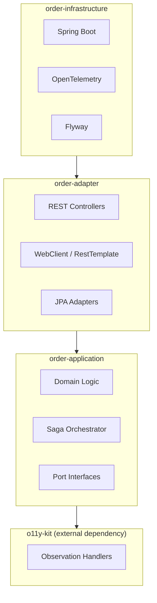

# observable-microservice

[](https://openjdk.org/projects/jdk/21/)
[](https://spring.io/projects/spring-boot)
[](https://maven.apache.org/)
[](https://github.com/sunny809/observable-microservice/actions)
[](LICENSE)

**A production-ready Spring Boot microservice blueprint demonstrating observability-first architecture with OpenTelemetry tracing, unified HTTP metrics, and structured logging.**

> This project is a living reference implementation that shows how to build a microservice with **built-in observability** — not as an afterthought, but woven into the architecture from day one.

---

## What This Blueprint Demonstrates

### 📊 Observability (Three Pillars)

| Pillar | Implementation | What You'll See |
|--------|----------------|-----------------|
| **Metrics** | Micrometer + Prometheus | `o11y.server.requests`, `o11y.client.requests`, `orders.placed`, `saga.duration` at `/actuator/prometheus` |
| **Tracing** | OpenTelemetry + Jaeger | End-to-end trace IDs via W3C `traceparent` / B3 propagation, visualized in Jaeger |
| **Logging** | Logstash + MDC | Structured JSON logs with `traceId`, `service`, `version` in every log line |

All HTTP traffic — inbound controllers and outbound WebClient/RestTemplate calls — is automatically instrumented via [o11y-kit](https://github.com/sunny809/o11y-kit), a lightweight Spring HTTP observability SDK.

### 🏛️ Hexagonal Architecture

Strict port/adapter separation enforced at compile time by ArchUnit:

- **Domain layer** (`order-application`): pure Java, zero framework dependencies
- **Adapter layer** (`order-adapter`): REST controllers, HTTP clients, persistence
- **Infrastructure layer** (`order-infrastructure`): Spring Boot entry point, configuration



### 🔄 Saga Pattern with Distributed Tracing

The `OrderPlacementSaga` coordinates four services (Inventory → Order DB → WMS → TMS) with full compensation logic. Every saga step is traced end-to-end:

```text
POST /api/v1/orders → Reserve Inventory → Persist Order → Send WMS → Confirm Inventory
                         ↓ failure              ↓ WMS reject          ↓ WMS picking complete
                    Release All (compensation)   REJECTED          → Send TMS → Dispatching
```

### 🛡️ Resilience Patterns

- **Circuit Breakers**: Resilience4j with per-service thresholds (50% failure, 80% slow call)
- **Retry**: Exponential backoff (500ms × 2ⁿ, 3 attempts)
- **Rate Limiting**: 100 requests/minute on order placement
- **Idempotency**: Dual-layer (Caffeine cache + database unique constraint)

---

## Quick Start

```bash
# Prerequisites: Java 21, Maven 3.9+, Docker

# 1. Start infrastructure (Jaeger, PostgreSQL)
docker-compose up -d

# 2. Build the project
mvn clean install -DskipTests

# 3. Run tests
mvn verify

# 4. Start the application
mvn -pl order-infrastructure spring-boot:run
```

Once running:

| Service | URL |
|---------|-----|
| Order API | `http://localhost:8080/api/v1/orders` |
| Swagger UI | `http://localhost:8080/swagger-ui.html` |
| Health | `http://localhost:8080/actuator/health` |
| Prometheus | `http://localhost:8080/actuator/prometheus` |
| Jaeger UI | `http://localhost:16686` |

### Try It

```bash
curl -X POST http://localhost:8080/api/v1/orders \
  -H "Content-Type: application/json" \
  -d '{
    "customerId": "cust-1",
    "idempotencyKey": "order-001",
    "items": [{"sku": "SKU-1", "quantity": 2}]
  }'
```

---

## Observability Stack

The project provides a complete local observability stack via docker-compose, started with a single command:

```bash
docker compose up -d
```

| Component   | URL                              | Description                     |
|-------------|----------------------------------|---------------------------------|
| **Grafana** | http://localhost:3000            | Dashboards (admin/admin)        |
| **Prometheus** | http://localhost:9090         | Metric storage                  |
| **Loki**    | http://localhost:3100            | Log aggregation                 |
| **Jaeger**  | http://localhost:16686           | Distributed tracing             |

### Pre-configured Dashboards

- **Business Dashboard** — Order volume, success rate, saga duration, failure distribution, inventory reservations
- **Technical Dashboard** — JVM, DB connection pool, HTTP latency, circuit breaker status

> Note: Pre-existing Grafana and Prometheus components are already configured, but business metrics require sending order requests first to populate the dashboards.
>
> See [Verification Guide](docs/observability-verify.md) for step-by-step checks.

### Metrics (Prometheus)

The application exposes two tiers of metrics:

**o11y-kit auto-instrumentation** (all HTTP traffic):

| Metric | Type | Tags |
|--------|------|------|
| `o11y.server.requests` | Timer | `method`, `uri`, `status` |
| `o11y.client.requests` | Timer | `method`, `host`, `status` |
| `o11y.client.errors` | Counter | `method`, `host`, `error` |

**Custom business metrics**:

| Metric | Type | Tags |
|--------|------|------|
| `orders.placed` | Counter | `status` |
| `orders.failed` | Counter | `reason` |
| `inventory.reservation` | Counter | `sku`, `result` |
| `saga.duration` | Timer | `outcome` |

### Tracing (OpenTelemetry + Jaeger)

Trace IDs are propagated across all service boundaries using W3C `traceparent` and B3 headers. Each external call creates a child span, visible in Jaeger's trace view.

### Structured Logging

```json
{
  "@timestamp": "2026-06-20T12:00:00.000+08:00",
  "service": "order-service",
  "traceId": "abc123def456",
  "message": "Order persisted with 1 reservation(s): [resv-001]",
  "level": "INFO"
}
```

---

## Project Structure

```text
observable-microservice/
├── order-application/        # Domain logic, use cases, ports (pure Java)
│   ├── domain/               # Aggregates, value objects, events
│   ├── port/in/              # Inbound port interfaces
│   ├── port/out/             # Outbound port interfaces
│   └── service/              # Saga orchestrator
├── order-adapter/            # Adapter implementations
│   ├── inbound/rest/         # REST controllers, DTOs
│   ├── outbound/             # HTTP clients, JPA, Kafka adapters
│   ├── config/               # Spring configuration
│   ├── metrics/              # Custom Micrometer metrics
│   └── health/               # Service health indicators
├── order-infrastructure/     # Spring Boot entry, persistence, config
├── bdd-specs/                # Cucumber BDD tests
├── k8s/                      # Kubernetes manifests
├── helm/                     # Helm charts
└── docs/                     # Documentation
```

---

## Technology Stack

| Category | Technology |
|----------|-----------|
| **Language** | Java 21 |
| **Framework** | Spring Boot 3.4.3 |
| **Observability** | OpenTelemetry 1.37, Micrometer Prometheus, Logstash |
| **Resilience** | Resilience4j (circuit breaker, retry, rate limiter) |
| **Tracing** | Jaeger (OTLP gRPC) |
| **Persistence** | PostgreSQL 16, H2, Flyway |
| **Messaging** | Kafka (WMS adapter) |
| **API Docs** | SpringDoc OpenAPI 2.5 |
| **Security** | Spring Security OAuth2 / JWT |
| **Testing** | JUnit 5, Mockito, AssertJ, Cucumber, WireMock, Testcontainers |
| **Architecture** | ArchUnit (compile-time enforcement) |
| **Deployment** | Docker, Kubernetes, Helm |

---

## Related Projects

- [o11y-kit](https://github.com/sunny809/o11y-kit) — The lightweight Spring HTTP observability SDK extracted from this blueprint. Provides the `o11y.server.requests` and `o11y.client.requests` metrics with a single dependency.

---

## Documentation

- [Implementation Guide](docs/IMPLEMENTATION_GUIDE.md) — Developer-focused walkthrough of the codebase: architecture, request flow, design patterns, and how to extend the service.
- [Architecture Decision Records](ARCHITECTURE.md) — Key architectural decisions and their trade-offs.
- [Sprint Roadmap](docs/ROADMAP.md) — Release plan and current sprint status.

---

## License

This project is licensed under the MIT License.
