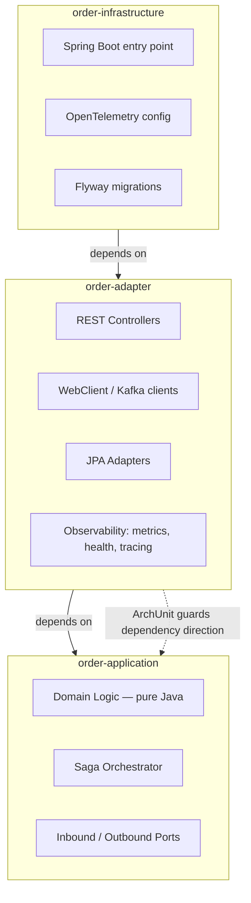

# observable-microservice

[](https://openjdk.org/projects/jdk/21/)
[](https://spring.io/projects/spring-boot)
[](https://maven.apache.org/)
[](https://github.com/sunny809/observable-microservice)
[](LICENSE)

**A production-ready Spring Boot microservice blueprint built on hexagonal architecture, a distributed saga, and full observability — with engineering quality guards enforced by the build itself.**

> This project is a living reference implementation. It demonstrates how to build a microservice where **observability is woven in from day one**, **architecture rules are enforced at compile time**, and **test/coverage standards are a build gate, not a hope**.

---

## Why This Blueprint Exists

`observable-microservice` is designed to show how a real-world order service should be put together when production-readiness matters:

- **Hexagonal architecture** with the dependency direction enforced by ArchUnit — you cannot accidentally leak domain logic into adapters and still build.
- **A distributed saga** that coordinates Inventory → Order DB → WMS → TMS with compensating transactions, so failure is handled, not just handled-well.
- **Observability as a first-class concern** — every request, every saga step, every outbound call is traceable end to end.
- **Quality as a build gate** — 85%+ line coverage, a testing pyramid, and architecture tests that run on every build.

---

## Core Highlights

### 🧱 Hexagonal Architecture, Enforced at Compile Time

Strict port/adapter separation. `order-application` is pure Java with **zero framework dependencies**; ArchUnit rules run on every build and fail the build on any dependency violation.



- **Ports** (`order-application`) define the contracts; **adapters** (`order-adapter`) implement them.
- ArchUnit `@ArchTest` rules enforce: application never depends on adapter/infrastructure, REST controllers stay in the inbound layer, entities stay in the outbound layer, services never touch JPA/WebClient directly.

### 🔄 Distributed Saga with Compensation

The `OrderPlacementSaga` orchestrates five steps, each traced end to end. Any failure triggers compensation (inventory release):

```text
POST /api/v1/orders
  → 1. Reserve Inventory
  → 2. Persist Order
  → 3. Send WMS Instruction
  → 4. WMS Picking Complete
  → 5. Send TMS / Dispatch
       ↓ failure (any step)
  → Compensate: release inventory, mark order rejected
```

- Async callbacks run reliably via `@TransactionalEventListener(AFTER_COMMIT)` + `CompletableFuture` + `TransactionTemplate` (see ADR-1).
- Idempotency is dual-layer: Caffeine cache (fast path) + database unique constraint (source of truth).
- **Cancellation** — `OrderCancellationSaga` runs the reverse flow: release inventory, void WMS, and transition to `CANCELLED`, idempotently and synchronously, before dispatch (ADR-7).

### 🔭 Observability — Three Pillars

| Pillar | Implementation | What You'll See |
|--------|----------------|-----------------|
| **Metrics** | Micrometer + Prometheus | `o11y.server.requests`, `o11y.client.requests`, `orders.placed`, `saga.duration` |
| **Tracing** | OpenTelemetry + Jaeger | End-to-end trace IDs via W3C `traceparent` / B3, visualized in Jaeger |
| **Logging** | Logstash + MDC | Structured JSON logs with `traceId`, `service`, `version` on every line |

All HTTP traffic — inbound controllers and outbound WebClient calls — is auto-instrumented via [o11y-kit](https://github.com/sunny809/o11y-kit), a lightweight Spring HTTP observability SDK.

### 🛡️ Resilience Patterns

- **Circuit Breakers**: Resilience4j with per-service thresholds (50% failure, 80% slow call)
- **Retry**: Exponential backoff (500ms × 2ⁿ, 3 attempts)
- **Rate Limiting**: 100 requests/minute on order placement
- **Idempotency**: Dual-layer (Caffeine cache + database unique constraint)

---

## Quality & Testing

Engineering rigor is a first-class deliverable, enforced on every build.

### Coverage — 85%+ Line, Per-Module Gate

| Module | Coverage Floor | Coverage* |
|--------|----------------|-----------|
| `order-application` (domain + saga) | **85%** | 95% |
| `order-infrastructure` | **85%** | 88% |
| `order-adapter` | 80% (interim) | 84% |

> *Measured line coverage; floors are enforced by JaCoCo `check` — the build **fails** below the floor (see ADR-4).

### Testing Pyramid

| Level | Technology | Purpose |
|-------|-----------|---------|
| **Unit** | JUnit 5, Mockito, AssertJ | Domain logic, saga, adapters — both pass **and** failure paths |
| **Integration** | Spring Boot Test, H2 | Persistence adapters, controller + repository wiring |
| **BDD** | Cucumber, WireMock | Black-box acceptance of the full saga via service virtualization |
| **Architecture** | ArchUnit | Compile-time dependency / layering enforcement |

Every test targets **specific assertions** and **business-scenario data** — the standard is "green **and** meaningful", never just "green" (see `CLAUDE.md` → Test Standards).

---

## Quick Start

```bash
# Prerequisites: Java 21, Maven 3.9+, Docker

# 1. Start the observability + infra stack (Jaeger, PostgreSQL, Grafana, Prometheus, Loki)
docker-compose up -d

# 2. Build and test the working modules (skips bdd-specs — see Known Issues below)
mvn -pl order-application,order-adapter,order-infrastructure clean install

# 3. Start the application
mvn -pl order-infrastructure spring-boot:run
```

> **Note on `mvn clean install`:** the full reactor build fails at `bdd-specs` on Java 25 (Spring's bundled ASM can't parse Java 25 class files). This is a known toolchain limitation, not a regression. The command above builds and tests all three production modules cleanly, including the coverage gate.

Once running:

| Service | URL |
|---------|-----|
| Order API | `http://localhost:8080/api/v1/orders` |
| Swagger UI | `http://localhost:8080/swagger-ui.html` |
| Health | `http://localhost:8080/actuator/health` |
| Prometheus | `http://localhost:8080/actuator/prometheus` |
| Jaeger UI | `http://localhost:16686` |
| Grafana | `http://localhost:3000` |

### Try It

```bash
curl -X POST http://localhost:8080/api/v1/orders \
  -H "Content-Type: application/json" \
  -d '{
    "customerId": "cust-1",
    "idempotencyKey": "order-001",
    "items": [{"sku": "SKU-1", "quantity": 2}]
  }'
```

---

## Observability Stack

The project provides a complete local observability stack via docker-compose, started with a single command:

```bash
docker compose up -d
```

| Component | URL | Description |
|-----------|-----|-------------|
| **Grafana** | http://localhost:3000 | Dashboards (admin/admin) |
| **Prometheus** | http://localhost:9090 | Metric storage |
| **Loki** | http://localhost:3100 | Log aggregation |
| **Jaeger** | http://localhost:16686 | Distributed tracing |

### Pre-configured Dashboards

- **Business Dashboard** — Order volume, success rate, saga duration, failure distribution, inventory reservations
- **Technical Dashboard** — JVM, DB connection pool, HTTP latency, circuit breaker status

> See [Verification Guide](docs/observability-verify.md) for step-by-step checks.

---

## Project Structure

```text
observable-microservice/
├── order-application/        # Domain logic, ports, saga (pure Java, zero framework deps)
│   ├── domain/               # Aggregates, value objects, events
│   ├── port/in/              # Inbound port interfaces
│   ├── port/out/             # Outbound port interfaces
│   └── service/              # Saga orchestrator
├── order-adapter/            # Adapter implementations (REST, HTTP, JPA, Kafka, observability)
│   ├── inbound/rest/         # REST controllers, DTOs
│   ├── outbound/             # HTTP clients, JPA, Kafka adapters
│   ├── observability/        # Tracer helper, span names
│   ├── metrics/              # Custom Micrometer metrics
│   └── health/               # Service health indicators
├── order-infrastructure/     # Spring Boot entry, OpenTelemetry config, Flyway
├── bdd-specs/                # Cucumber BDD tests with WireMock
├── k8s/  helm/  docker/      # Deployment manifests
└── docs/                     # Architecture decisions, guides, sprint reports
```

---

## Technology Stack

| Category | Technology |
|----------|-----------|
| **Language** | Java 21 |
| **Framework** | Spring Boot 3.4.3 |
| **Architecture** | Hexagonal (ports & adapters), ArchUnit compile-time enforcement |
| **Orchestration** | Saga pattern with compensating transactions |
| **Observability** | OpenTelemetry 1.37, Micrometer Prometheus, Logstash, Jaeger |
| **Resilience** | Resilience4j (circuit breaker, retry, rate limiter) |
| **Persistence** | PostgreSQL 16, H2, Flyway |
| **Messaging** | Kafka (WMS adapter) |
| **API Docs** | SpringDoc OpenAPI 2.5 |
| **Security** | Spring Security OAuth2 / JWT |
| **Testing** | JUnit 5, Mockito, AssertJ, Cucumber, WireMock, Testcontainers, ArchUnit |
| **Coverage** | JaCoCo (85%+ line, per-module build gate) |
| **Deployment** | Docker, Kubernetes, Helm |

---

## Related Projects

- [o11y-kit](https://github.com/sunny809/o11y-kit) — The lightweight Spring HTTP observability SDK extracted from this blueprint. Provides the `o11y.server.requests` and `o11y.client.requests` metrics with a single dependency.

---

## Documentation

- [Architecture Decision Records](ARCHITECTURE.md) — Key architectural decisions (ADR-1..ADR-4) and their trade-offs.
- [Implementation Guide](docs/IMPLEMENTATION_GUIDE.md) — Developer walkthrough: architecture, request flow, design patterns.
- [Roadmap](docs/ROADMAP.md) — Release plan and current sprint status.

---

## License

This project is licensed under the MIT License.
